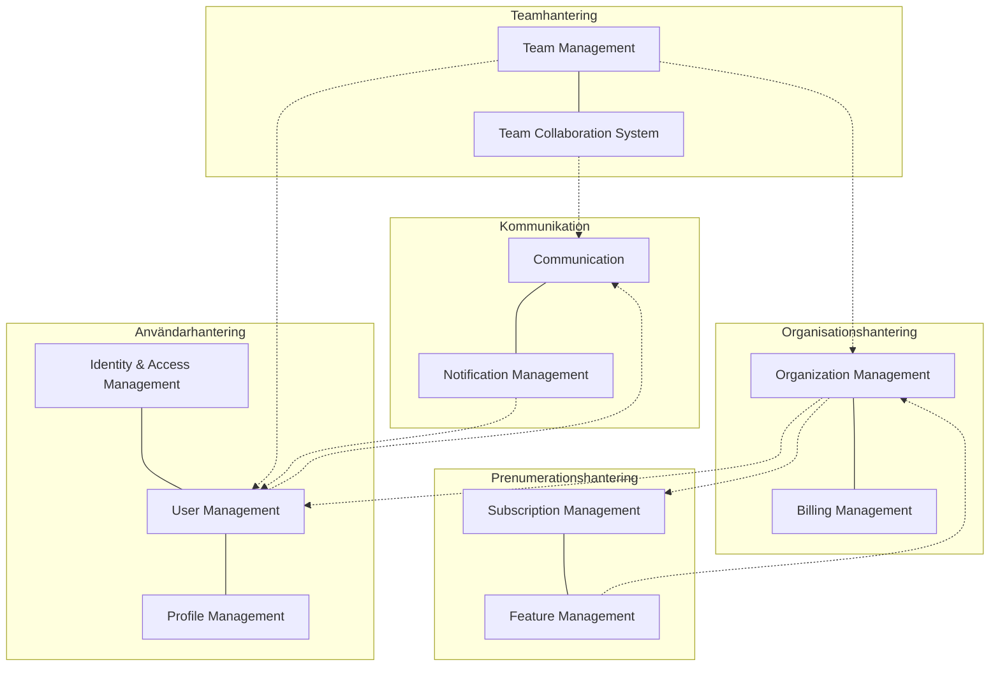
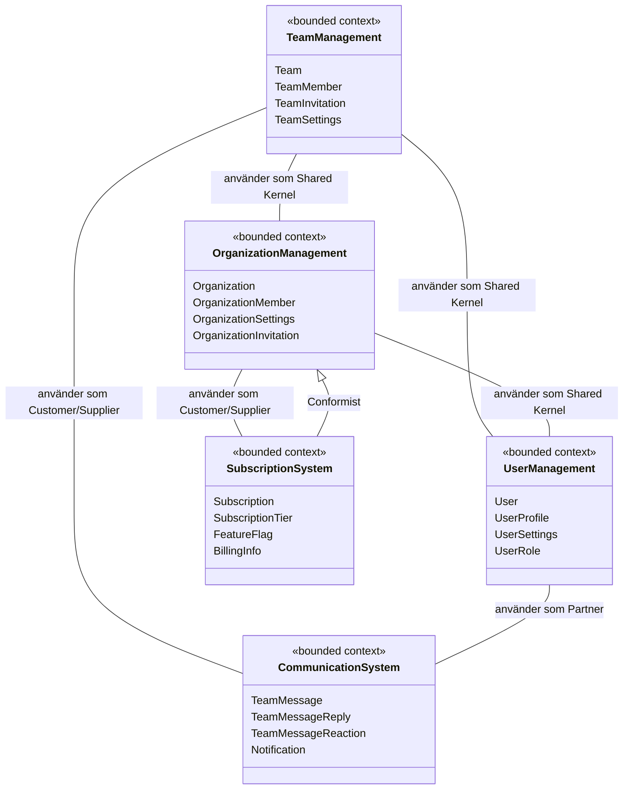
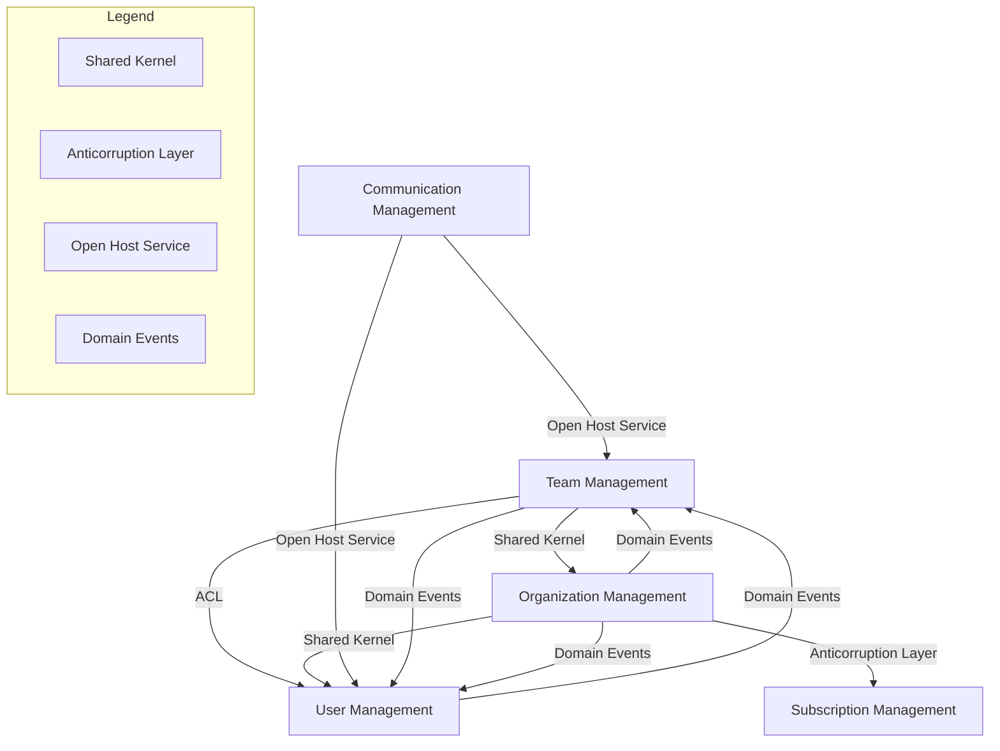
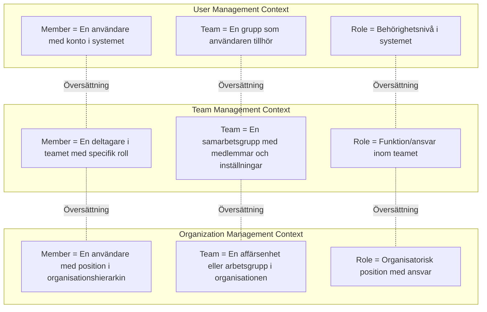

# Bundna Kontexter (Bounded Contexts)

Detta dokument visar en visualisering av de olika bundna kontexterna i systemet och hur de relaterar till varandra.

## Överblick över Bounded Contexts

Diagrammet nedan visar de huvudsakliga bundna kontexterna i systemet och deras relationer:

## Detaljerat Context Map

Detta diagram visar mer detaljerade relationer mellan de bundna kontexterna, inklusive vilka typer av relationer de har:

## Integration mellan Bundna Kontexter

Detta diagram visar hur de olika kontexterna integrerar med varandra genom olika strategier:

## Ubiquitous Language i Olika Kontexter

Detta diagram visar hur samma termer kan ha olika betydelser i olika bundna kontexter:

