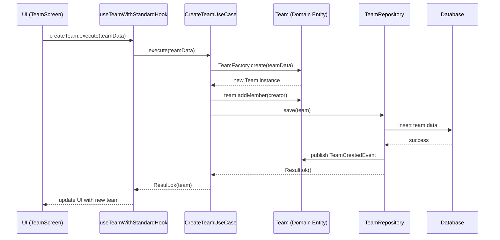

# Domain-Driven Design Arkitektur i Pling Mobile

## Översikt

Detta dokument beskriver den övergripande arkitekturen för Pling Mobile baserad på Domain-Driven Design (DDD) principer. Dokumentet är avsett att ge en klar bild av systemets struktur, ansvarsfördelning och designbeslut.

## Innehåll

1. [Arkitekturella principer](#arkitekturella-principer)
2. [Arkitekturella lager](#arkitekturella-lager)
3. [Domänmodell](#domänmodell)
4. [Applikationslager](#applikationslager)
5. [Infrastrukturlager](#infrastrukturlager)
6. [UI-lager](#ui-lager)
7. [Korsande aspekter](#korsande-aspekter)
8. [Databasen och persistens](#databasen-och-persistens)
9. [Best practices](#best-practices)

## Arkitekturella principer

Pling Mobile följer dessa grundläggande principer:

### Domain-Driven Design (DDD)
- **Ubiquitous Language**: En gemensam terminologi används konsekvent genom kod och kommunikation
- **Bounded Contexts**: Tydliga gränser mellan olika domäner (team, användare, organisation)
- **Domain Model**: Rika domänmodeller som fångar affärsregler och logik
- **Entities och Value Objects**: Tydlig distinktion mellan identitetsbärande entiteter och värde-objekt

### Clean Architecture
- **Beroenderegler**: Inre lager (domän) känner inte till yttre lager (infrastruktur)
- **Ports & Adapters**: Gränssnitt definieras i domänlagret, implementationer i yttre lager
- **Separation of Concerns**: Tydlig separation mellan olika ansvarsområden

### SOLID-principer
- **Single Responsibility**: Varje klass har ett specifikt ansvar
- **Open/Closed**: Öppen för utvidgning, stängd för modifiering
- **Liskov Substitution**: Underklasser ska kunna ersätta sina basklasser
- **Interface Segregation**: Små, specifika gränssnitt istället för stora, generella
- **Dependency Inversion**: Högre nivåer är oberoende av lägre nivåers implementation

## Arkitekturella lager

Systemet är indelat i följande huvudlager:

```
┌─────────────────────────────────────────────────┐
│                   UI-lager                      │
│             (Komponenter, Skärmar)              │
└───────────────────────┬─────────────────────────┘
                        │
┌───────────────────────▼─────────────────────────┐
│               Applikationslager                 │
│          (Use Cases, DTOs, Services)            │
└───────────────────────┬─────────────────────────┘
                        │
┌───────────────────────▼─────────────────────────┐
│                 Domänlager                      │
│   (Entities, Value Objects, Domain Services)    │
└───────────────────────┬─────────────────────────┘
                        │
┌───────────────────────▼─────────────────────────┐
│              Infrastrukturlager                 │
│  (Repositories, Adapters, Externa tjänster)     │
└─────────────────────────────────────────────────┘
```

### Beroenderegler

- **Domänlagret** är självständigt och har inga externa beroenden
- **Applikationslagret** beror endast på domänlagret
- **Infrastrukturlagret** implementerar gränssnitt från domänlagret
- **UI-lagret** kommunicerar endast med applikationslagret

## Domänmodell

Domänmodellen är kärnan i vår arkitektur och representerar de viktigaste affärskoncepten och reglerna.

### Entiteter
Entiteter är objekt med unik identitet som kan förändras över tid.

```typescript
export abstract class Entity<T> {
  protected readonly _id: UniqueEntityID;
  protected props: T;

  constructor(props: T, id?: UniqueEntityID) {
    this._id = id || new UniqueEntityID();
    this.props = props;
  }

  public equals(object?: Entity<T>): boolean {
    if (object === null || object === undefined) {
      return false;
    }

    if (this === object) {
      return true;
    }

    return this._id.equals(object._id);
  }

  get id(): UniqueEntityID {
    return this._id;
  }
}
```

### Aggregatrotsystem
Aggregatrötter kontrollerar åtkomst till och konsistens för en relaterad samling objekt.

```typescript
export abstract class AggregateRoot<T> extends Entity<T> {
  private _domainEvents: IDomainEvent[] = [];

  get domainEvents(): IDomainEvent[] {
    return this._domainEvents;
  }

  protected addDomainEvent(domainEvent: IDomainEvent): void {
    this._domainEvents.push(domainEvent);
  }

  public clearEvents(): void {
    this._domainEvents = [];
  }
}
```

### Värde-objekt
Värde-objekt är oföränderliga objekt som beskriver aspekter av domänen utan egen identitet.

```typescript
// Exempel på ett värde-objekt
export class TeamName {
  private readonly value: string;

  private constructor(value: string) {
    this.value = value;
  }

  public static create(name: string): Result<TeamName> {
    if (!name || name.trim().length === 0) {
      return Result.fail('Teamnamn kan inte vara tomt');
    }

    if (name.length > 50) {
      return Result.fail('Teamnamn kan inte överstiga 50 tecken');
    }

    return Result.ok(new TeamName(name.trim()));
  }

  public getValue(): string {
    return this.value;
  }
}
```

### Huvuddomäner

Systemet har följande huvuddomäner:

1. **Team-domänen**: Team, medlemmar, roller, aktiviteter och kommunikation
2. **User-domänen**: Användare, profiler, inställningar och behörigheter
3. **Organization-domänen**: Organisationer, resurser och prenumerationer

## Applikationslager

Applikationslagret samordnar domänobjekt för att utföra specifika uppgifter och fungerar som ett gränssnitt mellan domänen och yttre lager.

### Use Cases
Use Cases implementerar specifika användningsfall och orkestrerar domänobjekt.

```typescript
export class CreateTeamUseCase {
  private teamRepository: TeamRepository;
  private userRepository: UserRepository;
  private publisher: IDomainEventPublisher;

  constructor(
    teamRepository: TeamRepository,
    userRepository: UserRepository,
    publisher: IDomainEventPublisher
  ) {
    this.teamRepository = teamRepository;
    this.userRepository = userRepository;
    this.publisher = publisher;
  }

  async execute(dto: CreateTeamDTO): Promise<Result<Team>> {
    try {
      // Implementationsdetaljer...
    } catch (error) {
      return Result.fail(error);
    }
  }
}
```

### DTOs
Data Transfer Objects definierar strukturen för data som passerar in/ut från use cases.

```typescript
export interface CreateTeamDTO {
  name: string;
  description?: string;
  createdBy: string;
  initialMembers?: string[];
}
```

### Hooks
React hooks som kopplar domänlogik till UI-komponenter.

```typescript
export function useTeamWithStandardHook() {
  const { 
    createTeamUseCase, 
    getTeamUseCase 
  } = useTeamContext();

  // Implementation...

  return {
    createTeam,
    getTeam,
    // ...andra operationer
  };
}
```

## Infrastrukturlager

Infrastrukturlagret tillhandahåller tekniska implementationer av gränssnitt som definieras i domän- och applikationslagren.

### Repositories
Repositories ansvarar för dataåtkomst och persistens.

```typescript
export class SupabaseTeamRepository implements TeamRepository {
  private supabase: SupabaseClient;
  private teamMapper: TeamMapper;
  private publisher: IDomainEventPublisher;

  constructor(
    supabase: SupabaseClient,
    teamMapper: TeamMapper,
    publisher: IDomainEventPublisher
  ) {
    this.supabase = supabase;
    this.teamMapper = teamMapper;
    this.publisher = publisher;
  }

  // Implementationsdetaljer...
}
```

### Adapters
Adapters översätter mellan externa systemformat och domänmodeller.

```typescript
export class TeamMapper {
  static toDomain(raw: any): Result<Team> {
    // Mappningslogik från databas till domän
  }

  static toPersistence(team: Team): any {
    // Mappningslogik från domän till databas
  }
}
```

### Event Publishers
Hanterar publicering och hantering av domänevents.

```typescript
export class DomainEventPublisher implements IDomainEventPublisher {
  private subscribers: Map<string, IDomainEventSubscriber<IDomainEvent>[]>;
  
  constructor() {
    this.subscribers = new Map();
  }

  subscribe<T extends IDomainEvent>(
    eventType: string, 
    subscriber: IDomainEventSubscriber<T>
  ): void {
    // Implementation...
  }

  publish<T extends IDomainEvent>(event: T): void {
    // Implementation...
  }
}
```

## UI-lager

UI-lagret innehåller presentationslogik och användarinteraktion.

### Komponenter
Återanvändbara UI-komponenter som presenterar data och hanterar interaktion.

```tsx
function TeamList({ teams, onSelectTeam }) {
  return (
    <FlatList
      data={teams}
      renderItem={({ item }) => (
        <TeamListItem team={item} onPress={() => onSelectTeam(item)} />
      )}
      keyExtractor={(team) => team.id.toString()}
    />
  );
}
```

### Skärmar
Representerar fullständiga applikationsskärmar som samordnar komponenter.

```tsx
function TeamDetailsScreen({ route }) {
  const { teamId } = route.params;
  const { getTeam } = useTeamWithStandardHook();
  
  useEffect(() => {
    getTeam.execute({ teamId });
  }, [teamId]);

  // Render-logik...
}
```

### Context
React Context för delad tillstånd och beroendeinjektion.

```tsx
export const TeamContext = createContext<TeamContextProps | undefined>(undefined);

export function TeamProvider({ children }: { children: React.ReactNode }) {
  // Tillhandahåll beroenden för teamrelaterade operationer
  
  return (
    <TeamContext.Provider value={value}>
      {children}
    </TeamContext.Provider>
  );
}
```

## Korsande aspekter

Vissa aspekter skär igenom alla lager i arkitekturen.

### Felhantering
Standardiserat mönster för felhantering med Result-typen.

```typescript
export class Result<T> {
  private readonly _isSuccess: boolean;
  private readonly _error: any;
  private readonly _value: T;

  private constructor(isSuccess: boolean, error?: any, value?: T) {
    this._isSuccess = isSuccess;
    this._error = error;
    this._value = value as T;
  }

  public static ok<U>(value?: U): Result<U> {
    return new Result<U>(true, undefined, value);
  }

  public static fail<U>(error: any): Result<U> {
    return new Result<U>(false, error);
  }

  // Ytterligare metoder...
}
```

### Loggning
Konsekvent loggningsstrategi genom alla lager.

```typescript
const logger = createLogger('TeamRepository');
logger.info('Hämtar team', { teamId });
logger.error('Kunde inte hämta team', { error, teamId });
```

### Events
Domänevents för lös koppling mellan komponenter.

```typescript
export interface IDomainEvent {
  readonly eventType: string;
  readonly occurredOn: Date;
  readonly aggregateId: string;
}

// Exempel: TeamCreatedEvent
```

## Databasen och persistens

Pling Mobile använder Supabase som primär datalagring.

### Struktur
- **Teams**: Lagrar team-information
- **TeamMembers**: Lagrar relationer mellan team och användare
- **Users**: Lagrar användarinformation
- **Organizations**: Lagrar organisationsinformation
- **Subscriptions**: Lagrar prenumerationsinformation

### Åtkomstmönster
- Repositories använder Supabase-klienten för dataåtkomst
- Mapper-klasser översätter mellan databasformat och domänmodeller
- RLS (Row Level Security) för databasäkerhet
- Transaktionshantering för att säkerställa dataintegritetet

## Best practices

### Kod- och namngivningskonventioner
- **Entiteter**: PascalCase (Team, User, Organization)
- **Value Objects**: PascalCase (TeamName, Email)
- **Use Cases**: PascalCase + UseCase suffix (CreateTeamUseCase)
- **Repositories**: Interface med I-prefix (ITeamRepository) och konkreta implementationer med teknologi-prefix (SupabaseTeamRepository)
- **DTOs**: PascalCase + DTO suffix (CreateTeamDTO)
- **Events**: PascalCase + Event suffix (TeamCreatedEvent)

### Standardmönster

#### Repository-mönster
```typescript
export interface TeamRepository {
  findById(id: string): Promise<Result<Team>>;
  findByIds(ids: string[]): Promise<Result<Team[]>>;
  save(team: Team): Promise<Result<void>>;
  // Ytterligare metoder...
}
```

#### Factory-mönster
```typescript
export class TeamFactory {
  static create(dto: CreateTeamDTO): Result<Team> {
    const nameResult = TeamName.create(dto.name);
    if (nameResult.isFailure()) {
      return Result.fail(nameResult.getError());
    }

    // Ytterligare validering och skapandelogik...
  }
}
```

#### Event-mönster
```typescript
export class TeamCreatedEvent implements IDomainEvent {
  readonly eventType = 'team.created';
  readonly occurredOn: Date;
  readonly aggregateId: string;
  readonly teamName: string;
  readonly createdBy: string;

  constructor(team: Team) {
    this.aggregateId = team.id.toString();
    this.teamName = team.name.getValue();
    this.createdBy = team.createdBy;
    this.occurredOn = new Date();
  }
}
```

### Testning
- Enhetstester för domänlogik och use cases
- Integrationstester för repositories och adapters
- UI-tester för komponenter och skärmar
- Mockning av externa beroenden

## Flödesexempel

### Skapa ett team



### Slutsats

Denna arkitektur ger en stabil grund för robust, underhållbar och testbar kod som tydligt representerar vår affärsdomän. Den följer etablerade designprinciper och mönster samtidigt som den är anpassad för vår specifika applikation.

Genom att följa dessa arkitekturprinciper kan utvecklare enklare förstå systemet, göra säkra ändringar och utöka funktionaliteten utan att riskera oväntade bieffekter eller teknisk skuld. 