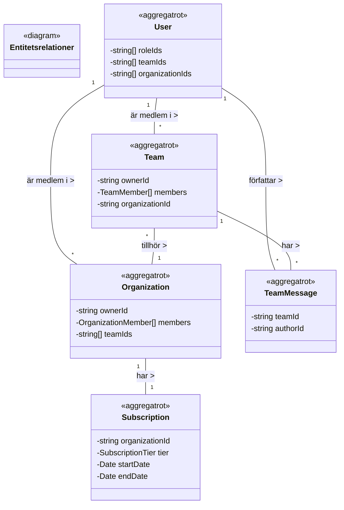
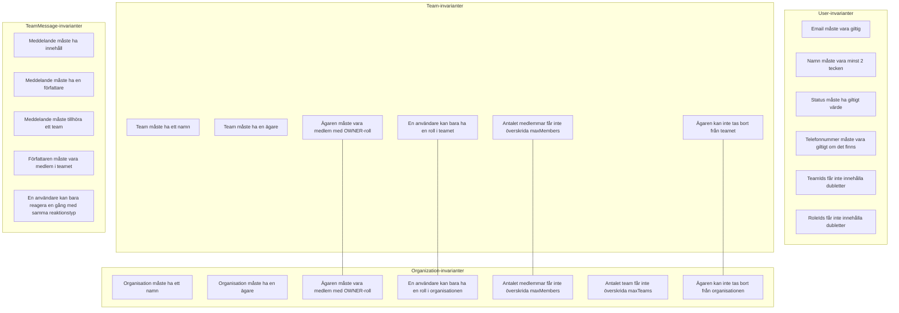

# Visualiseringar av Domänmodellen

Detta dokument innehåller visualiseringar av vår domänmodell med fokus på aggregatgränser, entitetsrelationer och event-flöden.

## Aggregatgränser

Nedan visas huvudaggregaten i systemet och deras interna struktur:

```mermaid
classDiagram
    class Aggregatgränser {
        <<diagram>>
    }
    
    %% Användaraggregat
    class User {
        <<aggregatrot>>
        -UniqueId id
        -Email email
        -string name
        -UserProfile profile
        -UserSettings settings
        -UserStatus status
        -string[] roleIds
        -string[] teamIds
        +addRole(roleId)
        +removeRole(roleId)
        +addTeam(teamId)
        +removeTeam(teamId)
        +updateProfile(profileData)
        +updateSettings(settingsData)
        +updateStatus(newStatus)
    }
    
    class UserProfile {
        <<värde-objekt>>
        -string bio
        -string avatarUrl
        -string phone
        -NotificationPreference notificationPreference
    }
    
    class UserSettings {
        <<värde-objekt>>
        -PrivacySettings privacy
        -NotificationSettings notifications
        -ThemeSettings theme
    }
    
    %% Teamaggregat
    class Team {
        <<aggregatrot>>
        -UniqueId id
        -string name
        -string description
        -string ownerId
        -TeamSettings settings
        -TeamMember[] members
        -TeamInvitation[] pendingInvitations
        +addMember(member)
        +removeMember(memberId)
        +updateMemberRole(memberId, newRole)
        +inviteMember(email, role)
        +update(updateData)
    }
    
    class TeamMember {
        <<värde-objekt>>
        -UniqueId userId
        -TeamRole role
        -Date joinedAt
    }
    
    class TeamSettings {
        <<värde-objekt>>
        -int maxMembers
        -boolean isPrivate
        -NotificationSettings notificationSettings
        -CommunicationSettings communicationSettings
    }
    
    class TeamInvitation {
        <<värde-objekt>>
        -string email
        -UniqueId inviterId
        -TeamRole role
        -Date expiresAt
    }
    
    %% Organisationsaggregat
    class Organization {
        <<aggregatrot>>
        -UniqueId id
        -string name
        -string ownerId
        -OrganizationSettings settings
        -OrganizationMember[] members
        -OrganizationInvitation[] pendingInvitations
        -string[] teamIds
        +addMember(member)
        +removeMember(memberId)
        +updateMemberRole(memberId, newRole)
        +addTeam(teamId)
        +removeTeam(teamId)
        +update(updateData)
    }
    
    class OrganizationMember {
        <<värde-objekt>>
        -UniqueId userId
        -OrganizationRole role
        -Date joinedAt
    }
    
    class OrganizationSettings {
        <<värde-objekt>>
        -int maxMembers
        -int maxTeams
        -SubscriptionTier subscriptionTier
        -BillingInfo billingInfo
    }
    
    %% Meddelandeaggregat
    class TeamMessage {
        <<aggregatrot>>
        -UniqueId id
        -string teamId
        -string authorId
        -string content
        -Date createdAt
        -TeamMessageType type
        -TeamMessageAttachment[] attachments
        -TeamMessageReaction[] reactions
        -TeamMessageReply[] replies
        +addReply(reply)
        +addReaction(reaction)
        +removeReaction(userId, reactionType)
        +edit(newContent)
    }
    
    class TeamMessageReply {
        <<entitet>>
        -UniqueId id
        -string authorId
        -string content
        -Date createdAt
        -TeamMessageAttachment[] attachments
        -TeamMessageReaction[] reactions
    }
    
    class TeamMessageReaction {
        <<värde-objekt>>
        -string userId
        -string reactionType
        -Date createdAt
    }
    
    %% Relationer
    User *-- UserProfile
    User *-- UserSettings
    
    Team *-- TeamMember
    Team *-- TeamSettings
    Team *-- TeamInvitation
    
    Organization *-- OrganizationMember
    Organization *-- OrganizationSettings
    
    TeamMessage *-- TeamMessageReply
    TeamMessage *-- TeamMessageReaction
```

## Entitetsrelationer

Detta diagram visar relationerna mellan de olika aggregaten i systemet:

## Event-flöden

Diagram som visar hur domänevents flödar genom systemet:

```mermaid
flowchart TB
    subgraph "Användardomän"
        UserCreated["UserCreatedEvent"]
        UserProfileUpdated["UserProfileUpdatedEvent"]
        UserStatusChanged["UserStatusChangedEvent"]
        UserRoleAdded["UserRoleAddedEvent"]
        UserRoleRemoved["UserRoleRemovedEvent"]
        UserTeamAdded["UserTeamAddedEvent"]
        UserTeamRemoved["UserTeamRemovedEvent"]
    end
    
    subgraph "Teamdomän"
        TeamCreated["TeamCreatedEvent"] 
        TeamUpdated["TeamUpdatedEvent"]
        TeamDeleted["TeamDeletedEvent"]
        TeamMemberJoined["TeamMemberJoinedEvent"]
        TeamMemberLeft["TeamMemberLeftEvent"]
        TeamMemberRoleChanged["TeamMemberRoleChangedEvent"]
        TeamMessageCreated["TeamMessageCreatedEvent"]
    end
    
    subgraph "Organisationsdomän"
        OrganizationCreated["OrganizationCreatedEvent"]
        OrganizationUpdated["OrganizationUpdatedEvent"]
        OrganizationMemberJoined["OrganizationMemberJoinedEvent"]
        OrganizationMemberLeft["OrganizationMemberLeftEvent"]
        OrganizationMemberRoleChanged["OrganizationMemberRoleChangedEvent"]
        TeamAddedToOrganization["TeamAddedToOrganizationEvent"]
        TeamRemovedFromOrganization["TeamRemovedFromOrganizationEvent"]
    end
    
    %% User -> Team events
    UserCreated --> TeamMemberJoined
    UserProfileUpdated --> TeamUpdated
    UserStatusChanged --> TeamMemberLeft
    
    %% Team -> User events
    TeamCreated --> UserTeamAdded
    TeamDeleted --> UserTeamRemoved
    TeamMemberJoined --> UserTeamAdded
    TeamMemberLeft --> UserTeamRemoved
    
    %% Organization -> Team events
    OrganizationCreated --> TeamCreated
    OrganizationMemberJoined --> TeamMemberJoined
    OrganizationMemberLeft --> TeamMemberLeft
    
    %% Team -> Organization events
    TeamCreated --> TeamAddedToOrganization
    TeamDeleted --> TeamRemovedFromOrganization
    
    %% Cross-domain handlers
    UserTeamAdded -.-> |"UserTeamJoinedHandler"| TeamMemberJoined
    TeamMemberJoined -.-> |"MemberJoinedHandler"| UserTeamAdded
    TeamCreated -.-> |"TeamCreatedHandler"| OrganizationUpdated
    OrganizationMemberJoined -.-> |"OrganizationMemberJoinedHandler"| TeamMemberJoined

```

## Invarianter och Affärsregler

Detta diagram visar de viktigaste invarianterna för varje aggregat:

