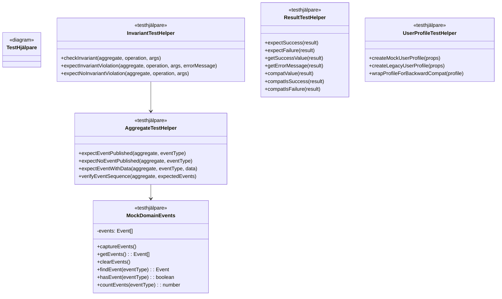
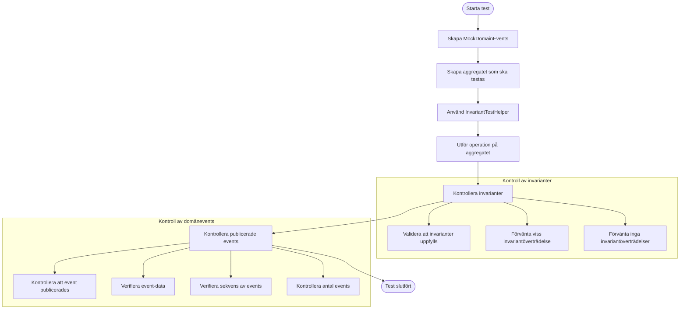
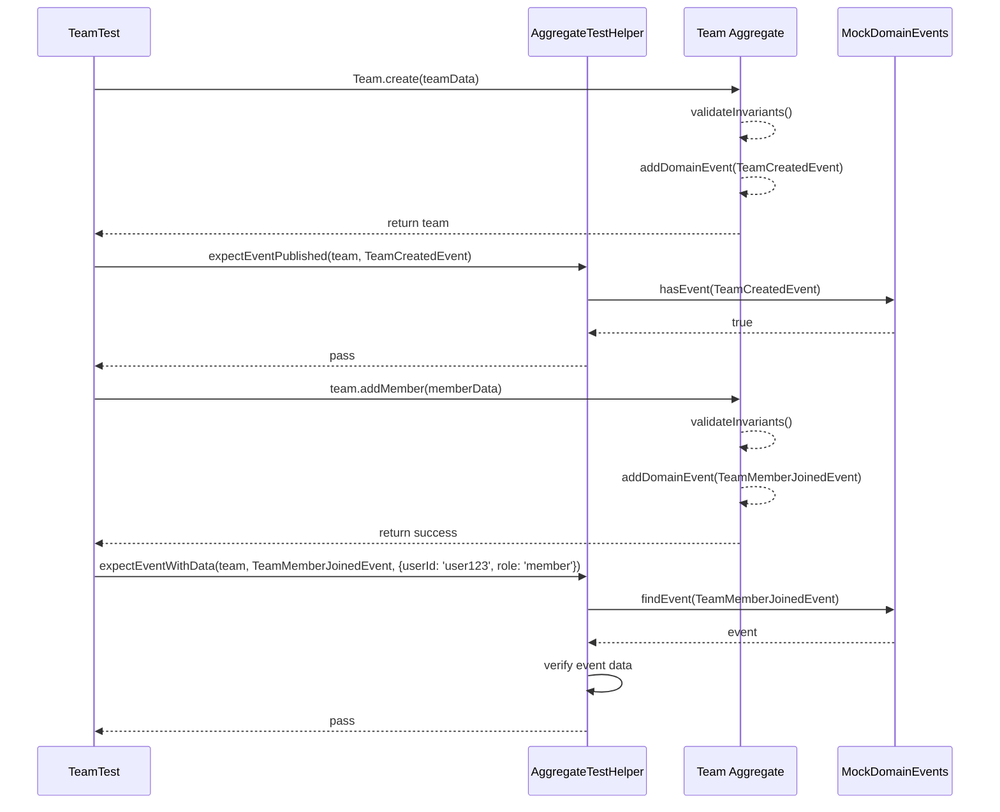
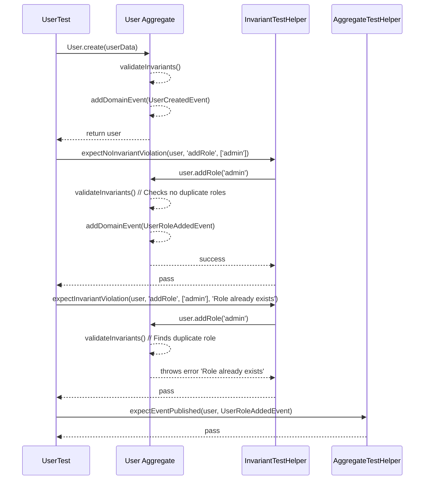
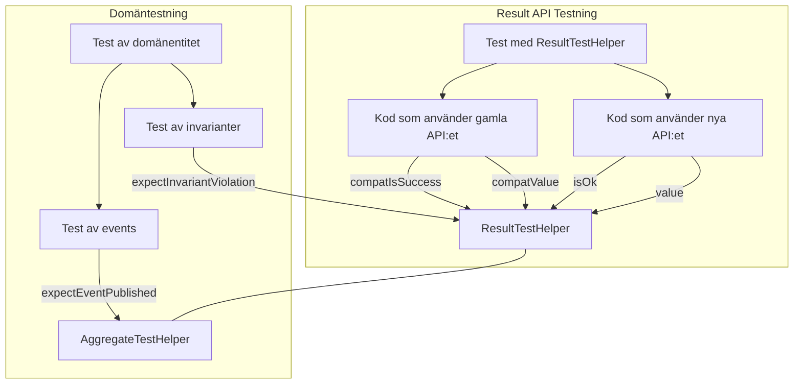
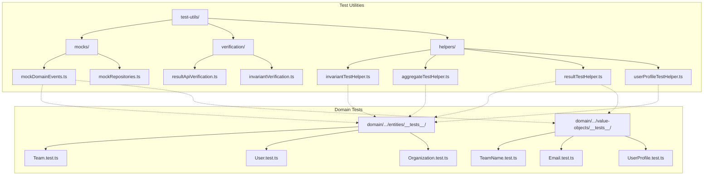

# Visualiseringar av Testhjälpare för Domänmodellen

Detta dokument visar hur testhjälparna relaterar till domänmodellen och hur de används för att testa aggregat, invarianter och event-publicering.

## Testhjälpare för Domäntestning

## Testflöde för Aggregat och Invarianter

## Testexempel för Team-aggregatet

## Testning av User-aggregatet med mockade events

## Integration med Result API-testning

## Testhjälparnas struktur i projektet

