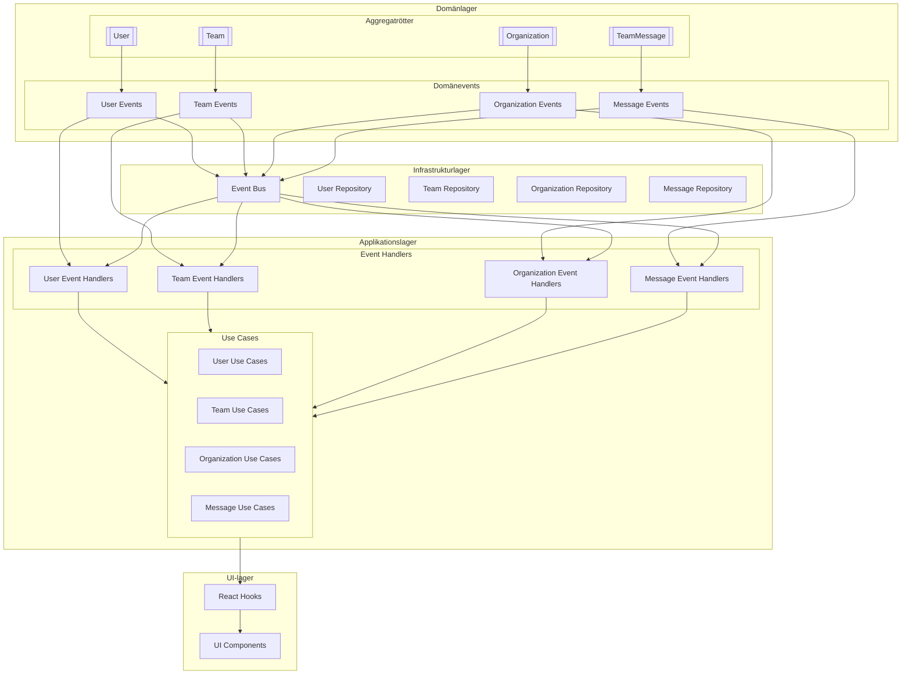
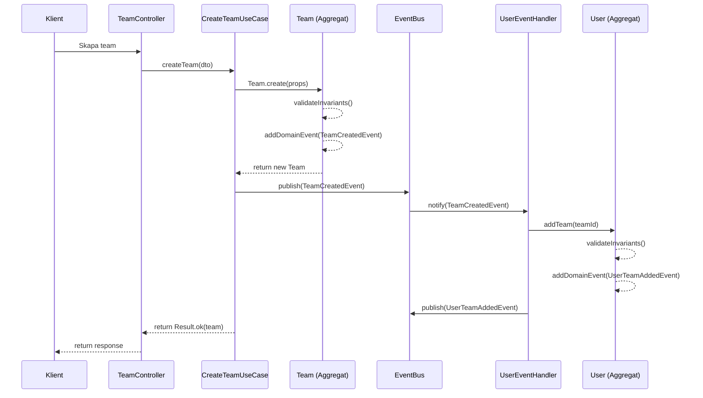
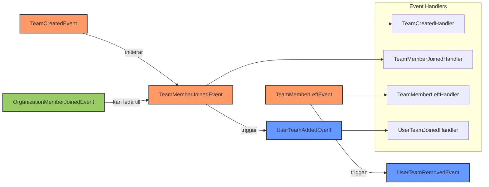
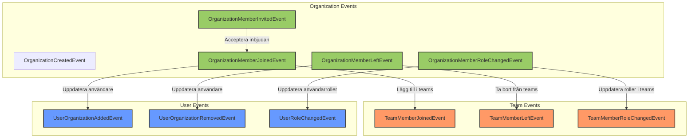
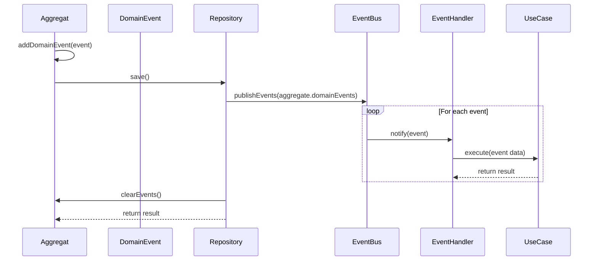

# Event-flöden i Systemet

Detta dokument visar detaljerade flödesdiagram för hur domänevents flödar mellan aggregat och domäner i systemet.

## Övergripande Event-flöde

## Detaljerat Event-flöde för Team Management

## Team Member Flow

## Organization Member Flow

## Event Publishing Process

## Cross-Domain Event Flow

```mermaid
graph TD
    %% Events
    UC[UserCreatedEvent]
    UPU[UserProfileUpdatedEvent]
    USC[UserStatusChangedEvent]
    UTA[UserTeamAddedEvent]
    UTR[UserTeamRemovedEvent]
    
    TC[TeamCreatedEvent]
    TD[TeamDeletedEvent]
    TMJ[TeamMemberJoinedEvent]
    TML[TeamMemberLeftEvent]
    TMRC[TeamMemberRoleChangedEvent]
    
    OC[OrganizationCreatedEvent]
    OMJ[OrganizationMemberJoinedEvent]
    OML[OrganizationMemberLeftEvent]
    OMRC[OrganizationMemberRoleChangedEvent]
    TATO[TeamAddedToOrganizationEvent]
    TRFO[TeamRemovedFromOrganizationEvent]
    
    %% Cross-domain connections
    UC -->|"UserCreatedHandler"| TMJ
    UPU -->|"UserProfileUpdatedHandler"| TMJ
    USC -->|"UserStatusChangedHandler"| TML
    
    TC -->|"TeamCreatedHandler"| UTA
    TD -->|"TeamDeletedHandler"| UTR
    TMJ -->|"TeamMemberJoinedHandler"| UTA
    TML -->|"TeamMemberLeftHandler"| UTR
    
    OC -->|"OrganizationCreatedHandler"| TC
    OMJ -->|"OrganizationMemberJoinedHandler"| TMJ
    OML -->|"OrganizationMemberLeftHandler"| TML
    
    TC -->|"TeamCreatedHandler"| TATO
    TD -->|"TeamDeletedHandler"| TRFO
    
    %% Grouping
    subgraph UserDomain[User Domain]
        UC
        UPU
        USC
        UTA
        UTR
    end
    
    subgraph TeamDomain[Team Domain]
        TC
        TD
        TMJ
        TML
        TMRC
    end
    
    subgraph OrgDomain[Organization Domain]
        OC
        OMJ
        OML
        OMRC
        TATO
        TRFO
    end
    
    %% Styling
    classDef userEvent fill:#69f,stroke:#333,stroke-width:1px;
    classDef teamEvent fill:#f96,stroke:#333,stroke-width:1px;
    classDef orgEvent fill:#9c6,stroke:#333,stroke-width:1px;
    
    class UC,UPU,USC,UTA,UTR userEvent;
    class TC,TD,TMJ,TML,TMRC teamEvent;
    class OC,OMJ,OML,OMRC,TATO,TRFO orgEvent;
``` 

