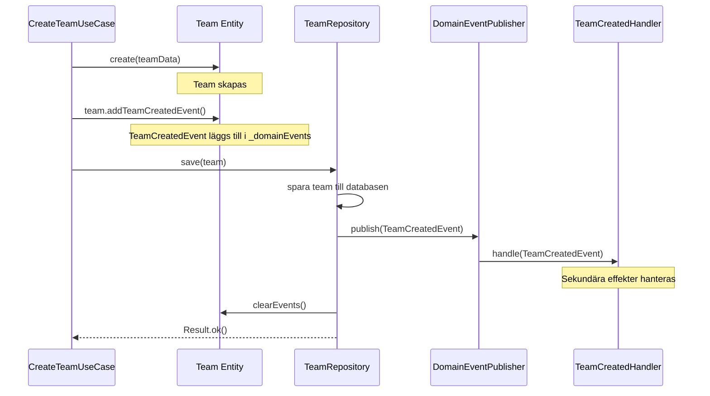
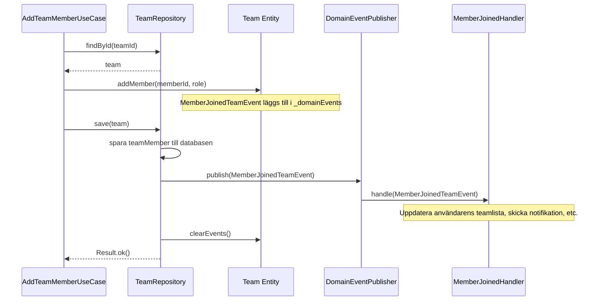

# Domäneventssystem

Detta dokument beskriver hur domänevents är implementerade och används i Pling Mobile. Eventssystemet är en central del av vår Domain-Driven Design-arkitektur och möjliggör lös koppling mellan olika komponenter.

## Innehåll

1. [Översikt](#översikt)
2. [Eventstrukturer](#eventstrukturer)
3. [Publicering och prenumeration](#publicering-och-prenumeration)
4. [Event handlers](#event-handlers)
5. [Flödesexempel](#flödesexempel)
6. [Best practices](#best-practices)

## Översikt

I Pling Mobile representerar domänevents något betydelsefullt som har inträffat i domänen. Events används för att:

- Notifiera andra delar av systemet om förändringar
- Säkerställa konsistens mellan aggregater
- Möjliggöra lös koppling mellan systemkomponenter
- Implementera event sourcing-mönstret där det är tillämpligt

Eventsystemet bygger på publish-subscribe mönstret, där aggregatrötter publicerar events och event handlers prenumererar på specifika event typer.

## Eventstrukturer

### IDomainEvent Interface

Alla domänevents i systemet implementerar `IDomainEvent`-interfacet:

```typescript
export interface IDomainEvent {
  readonly eventType: string;  // Unik identifierare för eventtypen
  readonly occurredOn: Date;   // Tidpunkten då händelsen inträffade
  readonly aggregateId: string; // ID för den aggregatrot som genererade eventet
}
```

### Domänspecifika bas-events

För varje domän har vi skapat basklasser för events:

```typescript
// Basevents för Team-domänen
export abstract class BaseTeamEvent implements IDomainEvent {
  readonly occurredOn: Date;
  readonly aggregateId: string;
  abstract readonly eventType: string;

  constructor(team: Team) {
    this.aggregateId = team.id.toString();
    this.occurredOn = new Date();
  }
}

// Basevents för User-domänen
export abstract class BaseUserEvent implements IDomainEvent {
  readonly occurredOn: Date;
  readonly aggregateId: string;
  abstract readonly eventType: string;

  constructor(user: User) {
    this.aggregateId = user.id.toString();
    this.occurredOn = new Date();
  }
}
```

### Specifika eventtyper

Events definieras för specifika händelser i domänen:

```typescript
export class TeamCreatedEvent extends BaseTeamEvent {
  readonly eventType = 'team.created';
  readonly teamName: string;
  readonly createdBy: string;

  constructor(team: Team) {
    super(team);
    this.teamName = team.name.getValue();
    this.createdBy = team.createdBy;
  }
}

export class MemberJoinedTeamEvent extends BaseTeamEvent {
  readonly eventType = 'team.member.joined';
  readonly memberId: string;
  readonly memberRole: string;

  constructor(team: Team, memberId: string, role: string) {
    super(team);
    this.memberId = memberId;
    this.memberRole = role;
  }
}
```

## Publicering och prenumeration

### IDomainEventPublisher Interface

Event-publishern definieras genom följande interface:

```typescript
export interface IDomainEventPublisher {
  publish<T extends IDomainEvent>(event: T): void;
  subscribe<T extends IDomainEvent>(
    eventType: string, 
    subscriber: IDomainEventSubscriber<T>
  ): void;
  clearListeners(): void;
}
```

### DomainEventPublisher Implementation

Den konkreta implementationen av `IDomainEventPublisher`:

```typescript
export class DomainEventPublisher implements IDomainEventPublisher {
  private subscribers: Map<string, IDomainEventSubscriber<IDomainEvent>[]>;
  
  constructor() {
    this.subscribers = new Map();
  }

  subscribe<T extends IDomainEvent>(
    eventType: string, 
    subscriber: IDomainEventSubscriber<T>
  ): void {
    if (!this.subscribers.has(eventType)) {
      this.subscribers.set(eventType, []);
    }
    
    this.subscribers.get(eventType)!.push(subscriber as IDomainEventSubscriber<IDomainEvent>);
  }

  publish<T extends IDomainEvent>(event: T): void {
    const eventType = event.eventType;
    const eventSubscribers = this.subscribers.get(eventType) || [];
    
    for (const subscriber of eventSubscribers) {
      subscriber.handle(event);
    }
  }

  clearListeners(): void {
    this.subscribers.clear();
  }
}
```

### AggregateRoot och events

Aggregatrötter ansvarar för att skapa och samla events:

```typescript
export abstract class AggregateRoot<T> extends Entity<T> {
  private _domainEvents: IDomainEvent[] = [];

  get domainEvents(): IDomainEvent[] {
    return this._domainEvents;
  }

  protected addDomainEvent(domainEvent: IDomainEvent): void {
    this._domainEvents.push(domainEvent);
  }

  public clearEvents(): void {
    this._domainEvents = [];
  }
}
```

### Användning i Repository

Repositories använder event publishern för att publicera events vid sparande av aggregater:

```typescript
export class SupabaseTeamRepository implements TeamRepository {
  private supabase: SupabaseClient;
  private publisher: IDomainEventPublisher;

  constructor(supabase: SupabaseClient, publisher: IDomainEventPublisher) {
    this.supabase = supabase;
    this.publisher = publisher;
  }

  async save(team: Team): Promise<Result<void>> {
    try {
      // Spara data till databasen...
      
      // Publicera alla events från aggregatroten
      const events = team.domainEvents;
      events.forEach(event => this.publisher.publish(event));
      
      // Rensa events efter publicering
      team.clearEvents();
      
      return Result.ok();
    } catch (error) {
      return Result.fail(error);
    }
  }
}
```

## Event Handlers

### IDomainEventSubscriber Interface

Alla event handlers implementerar `IDomainEventSubscriber`-interfacet:

```typescript
export interface IDomainEventSubscriber<T extends IDomainEvent> {
  handle(event: T): void;
}
```

### BaseEventHandler

En basklass för event handlers:

```typescript
export abstract class BaseEventHandler<T extends IDomainEvent> implements IDomainEventSubscriber<T> {
  protected logger: Logger;

  constructor(loggerName: string) {
    this.logger = createLogger(loggerName);
  }

  abstract handle(event: T): void;
}
```

### Konkret Event Handler

Exempel på en konkret event handler:

```typescript
export class TeamCreatedHandler extends BaseEventHandler<TeamCreatedEvent> {
  private userRepository: UserRepository;
  
  constructor(userRepository: UserRepository) {
    super('TeamCreatedHandler');
    this.userRepository = userRepository;
  }
  
  handle(event: TeamCreatedEvent): void {
    try {
      this.logger.info('Hanterar TeamCreatedEvent', { teamId: event.aggregateId });
      
      // Logik för att hantera eventet, t.ex. uppdatera användarens team-lista
      this.userRepository.addTeamToUser(event.createdBy, event.aggregateId);
      
    } catch (error) {
      this.logger.error('Fel vid hantering av TeamCreatedEvent', { 
        error, teamId: event.aggregateId 
      });
    }
  }
}
```

### Event Handler Factory

Factory för att skapa och registrera event handlers:

```typescript
export class TeamEventHandlerFactory {
  static createHandlers(
    userRepository: UserRepository,
    teamRepository: TeamRepository,
    publisher: IDomainEventPublisher
  ): void {
    // Skapa handlers
    const teamCreatedHandler = new TeamCreatedHandler(userRepository);
    const memberJoinedHandler = new MemberJoinedHandler(userRepository, teamRepository);
    
    // Registrera handlers med publisher
    publisher.subscribe('team.created', teamCreatedHandler);
    publisher.subscribe('team.member.joined', memberJoinedHandler);
  }
}
```

## Flödesexempel

### Flöde: Skapa ett team



### Flöde: Lägg till en medlem i ett team



## Best Practices

### När events ska användas

Använd events när:

1. En förändring i ett aggregat påverkar andra aggregat
2. Sidoeffekter ska utföras utan att påverka kärnlogiken
3. Flera subsystem behöver reagera på samma händelse
4. Asynkrona processer behöver triggas

### När events inte ska användas

Undvik events när:

1. Direkt dataåtkomst är mer lämplig
2. Operationen kräver omedelbar konsistens
3. Operationen är enkel och isolerad till ett aggregat

### Namngivning av events

- Använd namngivningskonventionen `[Substantiv].[Verb].[Predikat]`
- Använd alltid preteritum (förfluten tid) för eventnamn
- Exempel: `team.created`, `team.member.joined`, `user.profile.updated`

### Event-innehåll

- Inkludera alltid nödvändig information för att identifiera det berörda aggregatet
- Inkludera endast data som är relevant för eventet
- Undvik att inkludera komplett aggregatdata om det inte är nödvändigt
- Undvik cirkulära referenser i event-data

### Event handlers

- Håll event handlers enkla och fokuserade
- En handler bör ansvara för en specifik uppgift
- Hantera fel korrekt i handlers utan att påverka publiceringen av andra events
- Designa handlers för idempotens (samma event kan hanteras flera gånger utan bieffekter)

## Sammanfattning

Domäneventssystemet i Pling Mobile är utformat för att stödja lös koppling mellan domänkomponenter genom publish-subscribe mönstret. Aggregatrötter genererar events, repositories publicerar dem, och handlers reagerar på dem för att upprätthålla konsistens och utföra sidoeffekter i systemet.

Genom att följa dessa principer och mönster kan vi skapa ett system som är både robust och flexibelt, där förändringar i en del av systemet kan kommuniceras till andra delar på ett strukturerat sätt utan starka beroenden. 